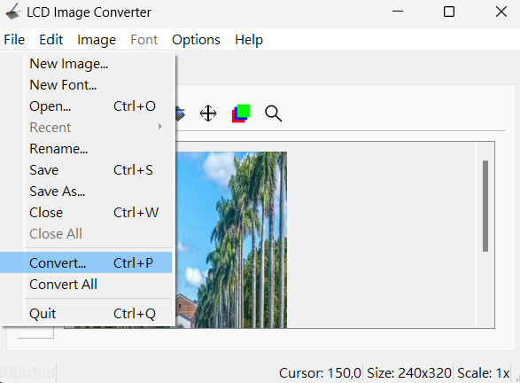

## 螢幕組
****
#### ST7789接線：
| ST7789腳位 | ESP32GPIO |
| --- | --- |
| VCC | 3.3V(供電) |
| GND | GND(接地) |
| SCL | 18(clock) |
| SDA | 23(MOSI) |
| RES | 4(重製) |
| DC | 2(數據選擇) |
| CS | 5(數據選擇) |
****  
#### ST7789函式(使用https://github.com/nopnop2002/esp-idf-st7789)：
###### 須宣告型別為TFT_t的變數當參數給函式，內含SPI腳位及螢幕相關資訊
| Function | Description |
|---|---|
| spi_master_init(&TFT_t, CONFIG_MOSI_GPIO, CONFIG_SCLK_GPIO, CONFIG_CS_GPIO, CONFIG_DC_GPIO, CONFIG_RESET_GPIO, CONFIG_BL_GPIO); | 初始化SPI(須提供腳位GPIO) |
| lcdInit(&TFT_t,CONFIG_WIDTH,CONFIG_HEIGHT,CONFIG_OFFSETX,CONFIG_OFFSETY); | 初始化lcd(須提供螢幕長寬) |
| lcdFillScreen(&TFT_t, uint16_t color); | 填充全螢幕(需指定顏色)
| lcdDrawPixel(&TFT_t,uint16_t x,uint16_t y,uint16_t color); | 填充像素點(需指定座標及顏色) |
| lcdDrawMultiPixels(&TFT_t,uint16_t x,uint16_t y,uint16_t size,uint16_t* colors); | 填充數個像素點(需指定座標及顏色) |
| lcdDrawLine(&TFT_t,uint16_t x1,uint16_t y1,uint16_t x2,uint16_t y2,uint16_t color); | 畫直線(需指定座標及顏色) |
| lcdDrawFillRect(&TFT_t,uint16_t x1,uint16_t y1,uint16_t x2,uint16_t y2,uint16_t color); | 畫長方形(需指定座標及顏色) |
| lcdDrawTriangle(&TFT_t,uint16_t xc,uint16_t yc,uint16_t w,uint16_t h,uint16_t angle,uint16_t color); | 畫三角形(需指定座標、角度及顏色) | 
| lcdDrawCircle(&TFT_t,uint16_t x0,uint16_t y0,uint16_t r,uint16_t color); | 畫空心圓(需指定座標、半徑及顏色) |
| lcdDrawFillCircle(&TFT_t,uint16_t x0,uint16_t y0,uint16_t r,uint16_t color); | 畫實心圓(需指定座標、半徑及顏色) |
****
#### 測試步驟
###### 1.在terminal打這串指令進入menuconfig

###### 2.按方向鍵選擇ST7789 Configuration後enter進入

###### 3.設定腳位及螢幕尺寸(按空白鍵後輸入數字完enter後按s儲存)

###### 4.terminal打這串指令編譯

###### 5.terminal打這串指令燒錄(需指定COM)

###### 6.[點我看測試結果影片](https://youtu.be/HgKVLeBPlRc)

****
#### 顯示自定義圖片的方法(需要事先decode)
###### 1.[下載LCD Image Converter](https://lcd-image-converter.riuson.com/en/about/)
###### 2.打開應用程式後選擇open打開圖片

###### 3.選擇options的conversions

###### 4.更改以下設定(選擇Color R5G6B5、UTF-8)


###### 5.選擇options的converter並指定檔案位置

###### 6.複製陣列的內容後使用以下函式
| Function | Description |
|---|---|
| lcdDrawPNG(&TFT_t,uint16_t x,uint16_t y,const uint16_t * PNG,int width,int height); | 顯示圖片(需指定起始位置、decode後的陣列名稱及圖片大小) |

[測試用project壓縮檔雲端連結，直接燒錄即可用，用事先decode的方法循環顯示圖片](https://drive.google.com/file/d/1Geh1kC2npjiGMlWulao-uL2aKiO1J3gw/view?usp=drive_link)
****    
#### 顯示自定義圖片的方法(沒有事先decode)
[Partition Tables參考資料](https://docs.espressif.com/projects/esp-idf/en/stable/esp32/api-guides/partition-tables.html)
[SPIFFS Filesystem參考資料](https://docs.espressif.com/projects/esp-idf/en/stable/esp32/api-reference/storage/spiffs.html)
###### ESP32 flash memory structure如下圖，存在此區域的資料在關機的時候不會被清空

###### 需要創建partitions.csv檔案(內容如下，新增空間命名為storage，記憶體分配位址為0x110000~0xF0000)去告訴ESP32要分配FREE SPACE(可自由使用的記憶體區域)的空間來存放指定的檔案
```
nvs,      data, nvs,     0x9000,  0x6000,
phy_init, data, phy,     0xf000,  0x1000,
factory,  app,  factory, 0x10000, 1M,
storage,  data, spiffs,  ,        0xF0000,
```
###### 到menuconfig的Partition Table選擇Custom


###### 在最外層的CMakeLists.txt新增這行程式，font為存放圖檔的資料夾名稱(跟字體存在一起)
```
spiffs_create_partition_image(storage font FLASH_IN_PROJECT)
```
###### 使用以下的程式碼使用ESP32 Fliesystem
```
#include "esp_spiffs.h"
esp_vfs_spiffs_conf_t conf = {
    .base_path = "/spiffs",
    .partition_label = NULL,
    .max_files = 12,
    .format_if_mount_failed =true
};
esp_err_t ret = esp_vfs_spiffs_register(&conf);
```
###### 在app_main(void)裡面加入以下程式碼顯示圖片(需要include <string.h>、"st7789.h"、"decode_png.h"、"pngle.h")，image為圖檔名稱
```
char file[32];
strcpy(file, "/spiffs/image.png");
lcdShowPNG(&TFT_t,0,0,file,CONFIG_WIDTH, CONFIG_HEIGHT);
```
###### lcdShowPNG用法如下
| Function | Description |
|---|---|
| lcdShowPNG(&TFT_t,uint16_t x,uint16_t y,file,int width,int height); | 顯示圖片(需指定起始位置、檔案路徑及圖片大小) |
###### 測試結果(圖片尺吋需為240*320 pixels)

###### 可使用以下函式增加fps，實測最高可將速度調整為60M
| Function | Description |
|---|---|
| void spi_clock_speed(int speed); | 設定SPI時脈速度(需指定速度) |     

[點我看測試結果影片](https://youtu.be/QXjT5e9RQVA?si=XQvgk_8ioQZ9uBVW)
****
#### 顯示文字的方法(需要include "fontx.h")
###### 相關函式如下
| Function | Description |
|---|---|
| lcdDrawChar(&TFT_t,FontxFile *fxs,uint16_t x,uint16_t y,uint8_t ascii,uint16_t color); | 顯示字元(需指定字體、ascii及顏色) |
| lcdDrawString(&TFT_t,FontxFile *fx,uint16_t x,uint16_t y,uint8_t * ascii,uint16_t color); | 顯示字串(需指定字體、ascii及顏色) |
###### 先設定字體
```
FontxFile fx16G[2];
FontxFile fx24G[2];
FontxFile fx32G[2];
InitFontx(fx16G,"/spiffs/ILGH16XB.FNT",""); // 8x16Dot Gothic
InitFontx(fx24G,"/spiffs/ILGH24XB.FNT",""); // 12x24Dot Gothic
InitFontx(fx32G,"/spiffs/ILGH32XB.FNT",""); // 16x32Dot Gothic
```
###### 在app_main(void)裡面加入以下程式碼顯示文字
```
uint16_t xpos = 0;
uint16_t ypos = 20;
uint8_t ascii[30];
uint16_t color = WHITE;
lcdSetFontDirection(&TFT_t, 0);
strcpy((char *)ascii, "hello world");
lcdDrawString(&TFT_t, fx16G, xpos, ypos, ascii, color);
lcdDrawString(&TFT_t, fx24G, xpos, ypos+30, ascii, color);
lcdDrawString(&TFT_t, fx32G, xpos, ypos+60, ascii, color);
```
###### 測試結果

****
[測試用project壓縮檔雲端連結，直接燒錄即可用，每隔5秒循環切換圖片及文字](https://drive.google.com/file/d/1Yhig8RLfQcOkAokDLTCaXy3n8GNjNfvn/view?usp=drive_link)