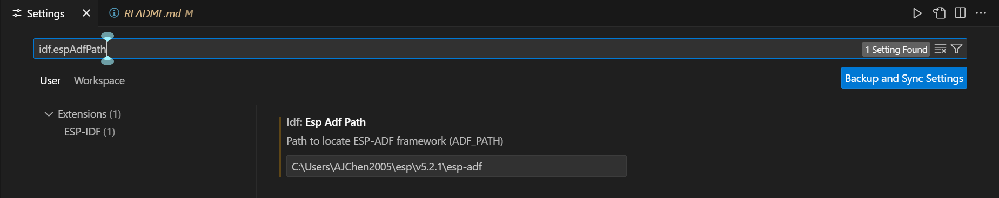
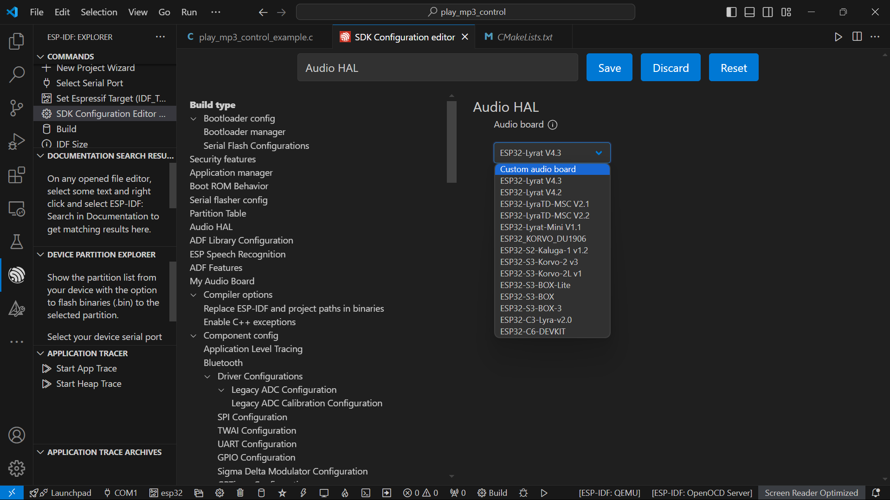
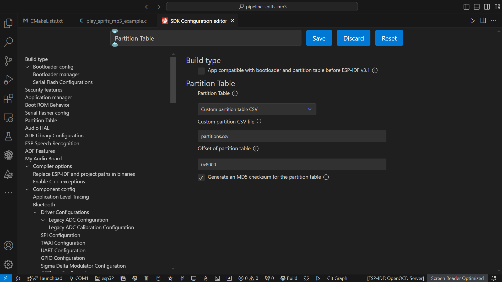

## 音響組

### 摘要

利用 MAX98375 作為 Codec Chip  
mp3 音檔撥放流程：  
```
[flash] ---> spiffs_stream ---> mp3_decoder ---> i2s_stream ---> [codec_chip]
```  
使用前須先載好 ESP-ADF 擴充，為專門為 audio 所開發的 framwork ， 以下會有說明  
預計包含音檔上傳、播放暫停、重新播放、音量控制等 function  

完成 ```ESP-ADF 環境設置``` 、 ```I2S 初始腳位設置``` 以及 ```Spiffs 設置``` 便可開發 audio 相關 

### 文件結構

```
Speaker/
├── pipeline_spiffs_mp3/
│   ├── main/
│   │   ├── play_spiffs_mp3_example.c
│   │   └── CMakeLists.txt
│   ├── components/
│   │   ├── my_board/
│   │   │   ├── my_board_v1_0/
│   │   │   │   ├── board_def.h
│   │   │   │   ├── board_pins_config.c
│   │   │   │   ├── board.c
│   │   │   │   └── board.h
│   │   │   ├── my_codec_driver/
│   │   │   │   ├── new_codec.c
│   │   │   │   └── new_codec.h
│   │   │   └── CMakeLists.txt
│   │   ├── my_component/
│   │   │   ├── include/
│   │   │   │   └── my_component.h
│   │   │   ├── src/
│   │   │   │   └── my_component.c
│   │   │   └── CMakeLists.txt
│   └── partitions.csv
└── tools/

```

<details>
    <summary><h3>環境設置</h3></summary>

<details>
    <summary><h4>ESP-ADF 環境設置</h4></summary>

#### 方法一（可能失敗）

1. In vscode, open ```command palette``` (in ```View``` at the top), enter ```install adf```. Then, a progress bar shows up in the lower right corner.

2.  You can open the example project of ESP-ADF now.

#### 方法二

1. Open command prompt, run the command below at the folder ```..\esp```  

    ```git clone --recursive https://github.com/espressif/esp-adf.git```.

2. Open ```command palette``` and enter ```open settings(ui)```.

3. Type ```idf.espAdfPath``` to find the setting of ```Esp Adf Path```.  

    

4. Paste the path of the ```esp-adf``` that you clone at the first step.

5. You can open the example project of ESP-ADF now.
</details>

<details>
    <summary><h4>I2S 初始腳位設置</h4></summary>

目的：更改初始 I2S 腳位設定

1. 將 ```pipeline_spiffs_mp3/components/my_board``` 中的 ```my_board``` 放進自己專案中的 ```components``` 作為客製化的開發板（應不影響原本的開發）。

2. 開啟 ```SDK Configuration Editor (menuconfig)```，搜尋 ```Audio HAL``` ，在 ```Audio board``` 中選擇 ```Custom audio board```。

    

3. 回到 ```/my_board``` 中，開啟 ```/my_board/my_board_v1_0/board_pins_config.c```，Ctrl F 尋找 ```get_i2s_pins```，確認 pin 腳是以下的設定（注意 bck、ws、data_out）：

    ```c
    esp_err_t get_i2s_pins(int port, board_i2s_pin_t *i2s_config)
    {
        AUDIO_NULL_CHECK(TAG, i2s_config, return ESP_FAIL);
        if (port == 0) {
            i2s_config->mck_io_num = GPIO_NUM_0;
            i2s_config->bck_io_num = GPIO_NUM_27;
            i2s_config->ws_io_num = GPIO_NUM_26;
            i2s_config->data_out_num = GPIO_NUM_25;
            i2s_config->data_in_num = GPIO_NUM_39;
        } else if (port == 1) {
            i2s_config->bck_io_num = -1;
            i2s_config->ws_io_num = -1;
            i2s_config->data_out_num = -1;
            i2s_config->data_in_num = -1;
        } else {
            memset(i2s_config, -1, sizeof(board_i2s_pin_t));
            ESP_LOGE(TAG, "i2s port %d is not supported", port);
            return ESP_FAIL;
        }

        return ESP_OK;
    }
    ```
</details>

<details>
    <summary><h4>Spiffs 設置</h4></summary>

目的：將音檔存進 flash 內

1. 新增 ```partitions.csv``` ，填入以下：

    ```csv
    # Name,   Type, SubType, Offset,  Size, Flags
    # Note: if you change the phy_init or app partition offset, make sure to change the offset in Kconfig.projbuild
    nvs,      data, nvs,     ,        0x6000,
    phy_init, data, phy,     ,        0x1000,
    factory,  app,  factory, ,        1M,
    storage,  data, spiffs,  0x110000,1M, 
    ```
    其中 ```storage``` 為我們額外分割出的空間提供音檔進行儲存

2. 在工作區新增名為 ```tools``` 的資料夾，將所需音檔放入

3. 在 ```/main/CMakeLists.txt``` 中加入這行： ```spiffs_create_partition_image(storage ../tools FLASH_IN_PROJECT)```

4. 開啟 ```SDK Configuration Editor (menuconfig)```，搜尋 ```Partition table```，確認已被設定為以下的狀態：

    
</details>

</details>

<details>
    <summary><h3>sample 與相關 function</h3></summary>

#### 文件結構

```
Speaker/
├── pipeline_spiffs_mp3/
│   ├── main/
│   │   ├── play_spiffs_mp3_example.c
│   │   └── CMakeLists.txt
│   ├── components/
│   │   ├── my_board/
│   │   │   ├── my_board_v1_0/
│   │   │   │   ├── board_def.h
│   │   │   │   ├── board_pins_config.c
│   │   │   │   ├── board.c
│   │   │   │   └── board.h
│   │   │   ├── my_codec_driver/
│   │   │   │   ├── new_codec.c
│   │   │   │   └── new_codec.h
│   │   │   └── CMakeLists.txt
│   │   ├── my_component/
│   │   │   ├── include/
│   │   │   │   └── my_component.h
│   │   │   ├── src/
│   │   │   │   └── my_component.c
│   │   │   └── CMakeLists.txt
│   └── partitions.csv
└── tools/

```

<details>
    <summary><h4>functions（位於 my_component 內）</h4></summary>

在 ```my_component/CMakeListLists.txt``` 中要加入 ```REQUIRES audio_pipeline audio_stream audio_hal esp_peripherals```

1. ```void initialize_audio_system()```

    初始化音頻系統，使用相關 function 需先初始化

2. ```void set_mp3(const char *file_path)```

    設置播放檔案（通常為 ```"/spiffs/..."```）

3. ```void start_mp3()``` 

    啟動播放系統（實際為啟動 spiff_stream）

4. ```void play_mp3()```

    播放音頻

5. ```void handle_audio_events()```

    監聽播放狀態

6. ```void set_audio_loop(bool is_loop)```

    設定是否循環播放，是的話輸入 true

7. ```void pause_audio()```

    暫停播放

8. ```void resume_audio()```

    恢復播放

<details>
    <summary><h4>sample（位於 my_component 內）</h4></summary>

    目前依照此 sample 可實作循環播放，但切換音樂尚未完善

    

